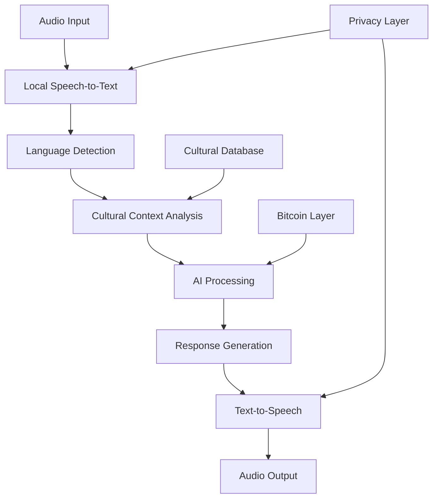

# Eva Audio-First System Architecture

> *"Making global Bitcoin economy accessible through voice, regardless of literacy or location"*

## 🎵 Vision: Voice-Native AI for Every Creator

Eva is designed as an **audio-first application** to ensure global accessibility. Inspired by meeting a Turkish grandmother selling handmade crafts, we realized that not every talented creator can read, write, or navigate complex interfaces - but everyone can speak and tell their story.

## 🌍 The Problem: Digital Divide in Creator Economy

**Current creator platforms assume:**
- ✅ Literacy in platform language
- ✅ Familiarity with complex UIs
- ✅ Access to traditional banking
- ✅ Understanding of digital marketing

**Reality for millions of creators worldwide:**
- ❌ Limited literacy or non-native language barriers
- ❌ Smartphone-only access in rural areas
- ❌ No access to traditional banking systems
- ❌ Rich cultural knowledge but no marketing skills

## 🎤 Eva's Audio-First Solution

### Core Design Principles

1. **Voice as Primary Interface**
   - Speak to Eva in your native language
   - No typing required for basic functionality
   - Audio guidance through every process

2. **Cultural Context Preservation**
   - Stories told in original language
   - Cultural terminology respected
   - Traditional knowledge captured authentically

3. **Bitcoin Financial Inclusion**
   - Lightning Network enables global payments
   - Audio-guided wallet setup
   - No traditional banking required

4. **Accessibility-Native Design**
   - Works for users with visual impairments
   - Motor limitations accommodated
   - Cognitive accessibility prioritized

## 🔄 System Process Flow

### 1. Artist Onboarding (Voice-Guided)

```
📱 User opens Eva app
    ↓
🎤 Eva: "Hello! I'm Eva. What's your name and what art do you create?"
    ↓
🗣️ User responds in their native language
    ↓
🔄 Language detection + cultural context setup
    ↓
✅ Personalized voice profile created
```

### 2. Artwork Documentation

```
📸 User takes photo of artwork (voice-guided)
    ↓
🎤 Eva: "Tell me the story behind this piece"
    ↓
🗣️ User shares cultural background, techniques, inspiration
    ↓
🔄 AI processes: Image analysis + Story transcription + Cultural context
    ↓
📝 Rich metadata created preserving cultural authenticity
```

### 3. Content Creation

```
🎤 User: "Eva, help me sell this artwork"
    ↓
🔄 Eva generates culturally-appropriate content:
    • Social media posts in multiple languages
    • Pricing suggestions based on cultural and market context
    • Platform-optimized descriptions
    ↓
🎤 Eva reads options aloud: "Here are 3 approaches..."
    ↓
🗣️ User selects preferred option via voice
```

### 4. Bitcoin Payment Integration

```
🎤 Eva: "Would you like to receive payments in Bitcoin?"
    ↓
🎤 Eva explains Bitcoin benefits in cultural context
    ↓
⚡ Lightning wallet setup with audio guidance
    ↓
🔒 User controls private keys (audio backup instructions)
    ↓
💰 Instant global payments without banking barriers
```

## 🏗️ Technical Architecture

### Voice Processing Pipeline



### Multi-Language Support

**Phase 1 Languages:**
- 🇹🇷 **Turkish** - Priority for validation with traditional craft community
- 🇩🇪 **German** - Local market and compliance
- 🇺🇸 **English** - Global marketplace access
- 🇫🇷 **French** - European expansion

**Cultural Adaptations:**
- **Turkish**: Traditional craft terminology, family/heritage focus
- **German**: Efficiency-focused, direct communication
- **English**: Global marketplace optimization
- **French**: Artistic heritage and cultural preservation emphasis

### Bitcoin Layer 2 Integration

```
Lightning Network Benefits for Audio-First Users:
✅ Instant payments without complex banking setup
✅ Global accessibility regardless of location
✅ Micropayments for cultural education content
✅ Community-controlled financial infrastructure
```

**RGB Smart Contracts for Cultural IP:**
- Automatic copyright protection for traditional techniques
- Provenance tracking for cultural artifacts
- Community-owned cultural knowledge preservation

## 🎯 User Experience Adaptation

### Traditional Crafts Artist Profile
```yaml
primary_language: "Turkish"
tech_comfort: "Low"
interaction_style: "Story-based, cultural context important"
eva_adaptations:
  - slower_speech_pace: true
  - cultural_terminology_respect: true
  - story_focused_content: true
  - simple_bitcoin_explanations: true
  - heritage_marketing_emphasis: true
```

### Digital Artist Profile
```yaml
primary_language: "English/German"
tech_comfort: "High"
interaction_style: "Quick commands, efficiency-focused"
eva_adaptations:
  - faster_interaction_pace: true
  - technical_details_available: true
  - advanced_marketing_strategies: true
  - platform_optimization_focus: true
  - community_building_features: true
```

## 🔒 Privacy & Security

### Voice Data Protection
- **No Permanent Storage**: Voice data processed and immediately deleted
- **Local Processing**: Speech-to-text happens on-device where possible
- **Encrypted Transmission**: All API calls encrypted end-to-end
- **User Sovereignty**: Artists control all Bitcoin private keys
- **Cultural Data Protection**: Community-owned cultural knowledge

### Accessibility Features
- **Visual Impairments**: Full voice navigation, audio descriptions
- **Motor Limitations**: Voice-only interaction mode
- **Cognitive Accessibility**: Patient tone, repetition on request, consistent commands

## 📱 Mobile-First Implementation

### Interface Design
```
🎤 Primary Microphone Button (75% of screen)
🔊 Audio Waveform Visualization (Eva listening indicator)
📸 Quick Camera Access (voice or gesture activated)
⚡ Bitcoin Status (audio notifications + minimal visual)
🌍 Language Selector (audio-guided)
```

### Offline Capabilities
- Basic voice commands processed locally
- Content creation cached for delayed sync
- Bitcoin transactions queue for connectivity
- Cultural database stored locally

## 🌍 Global Rollout Strategy

### Phase 1: Turkey (Validation)
- Turkish grandmother community testing
- Traditional craft focus
- Rural connectivity optimization
- Cultural advisor integration

### Phase 2: Germany (Compliance)
- GDPR-compliant voice processing
- Local art scene integration
- EU financial regulations compliance
- German language perfection

### Phase 3: Global Expansion
- Community-driven language additions
- Regional cultural adaptation
- Local payment method integration
- Marketplace localization

## 🛠️ Development Approach

### AI-Assisted Development
- System architecture designed by artist perspective
- Voice processing implemented with AI assistance
- Cultural sensitivity guided by community input
- Bitcoin integration leveraging proven protocols

### Community-Driven Features
- Cultural terminology sourced from community
- Voice training data from consenting artists
- Feature prioritization through democratic voting
- Regional adaptations led by local coordinators

## 📊 Success Metrics

### Accessibility Impact
- Artists onboarded who couldn't use traditional platforms
- Languages and cultural contexts supported
- Rural vs. urban adoption rates
- Age and literacy demographics served

### Economic Empowerment
- Bitcoin payments received by previously unbanked artists
- Cultural knowledge monetization
- Traditional technique preservation and transmission
- Cross-cultural art sales facilitated

### Technical Performance
- Voice recognition accuracy across languages
- Response time for audio interactions
- Offline functionality uptime
- Cultural context preservation quality

## 🚀 Getting Started

### For Contributors

**Voice Processing Development:**
```bash
# Clone repository
git clone https://github.com/evafame/evafame-creative-chain.git

# Install audio processing dependencies
npm install speech-recognition voice-synthesis

# Set up cultural context database
npm run setup-cultural-db
```

**Cultural Adaptation:**
- Join #cultural-adaptation Discord channel
- Review language-specific terminology databases
- Contribute regional market knowledge
- Test voice interactions in your native language

### For Artists

**Beta Testing:**
1. Download Eva app (coming soon)
2. Set up Lightning wallet with audio guidance
3. Upload artwork and tell your story
4. Receive Bitcoin payments globally
5. Provide feedback to improve cultural understanding

## 🤝 Community

- **Discord**: [Join our voice-first development community](https://discord.gg/evafame)
- **Newsletter**: [Weekly updates on audio-first progress](https://creativechain.substack.com)
- **GitHub Discussions**: [Technical architecture discussions](https://github.com/evafame/evafame-creative-chain/discussions)

## 📄 Documentation

- [Technical Architecture Deep Dive](docs/technical-architecture.md)
- [Cultural Adaptation Guidelines](docs/cultural-adaptation.md)
- [Voice Processing Implementation](docs/voice-processing.md)
- [Bitcoin Integration Specifications](docs/bitcoin-integration.md)
- [Accessibility Standards](docs/accessibility.md)

---

*"Every voice has a story. Every story has value. Eva ensures that value reaches the world."*

**[⭐ Star this repository](../../stargazers) if you believe every creator deserves accessible tools!**
